= Compte-rendu Sushi-App
:toc:
== Sommaire

Réalisé par :

- Balcerowiak Antoine

site : https://antoine-balcerowiak.github.io/Sushi-App/menu

github : https://github.com/Antoine-Balcerowiak/Sushi-App

Date début : Mars 2024

== Contexte

2ème projet de seconde année
de BTS SIO, le but est de créer un site de vente de boxes de sushi, les boxes de sushi sont recupérer
via une API puis affiché sur le site on peut en ajouter dans un panier puis commander et voir
l'historique de commande

== Introduction
Pour démarrer le projet, j'ai commencé par faire les maquettes de mon site avec Menu, détail,
panier, historique et confirmation de la commande

== Maquette

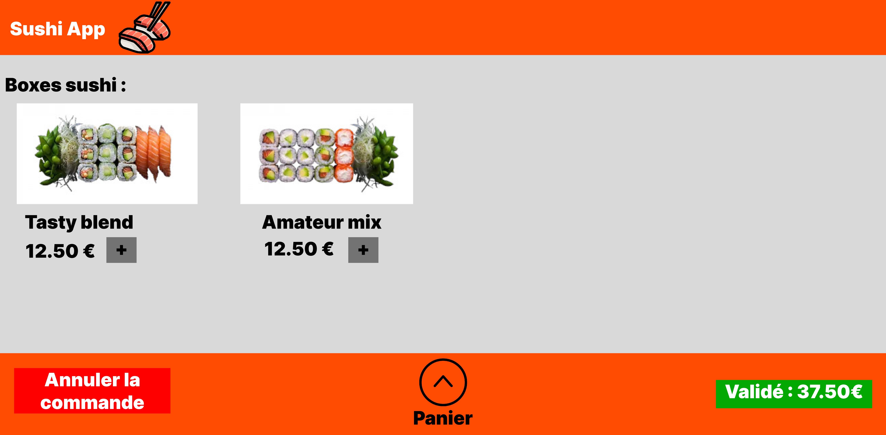
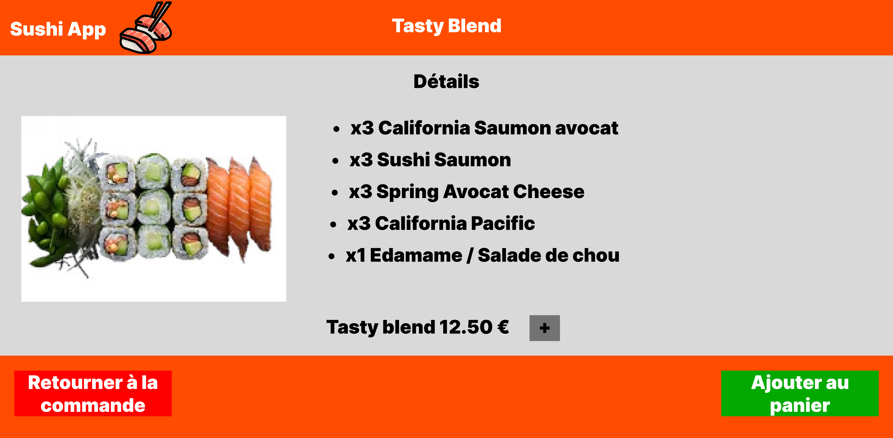
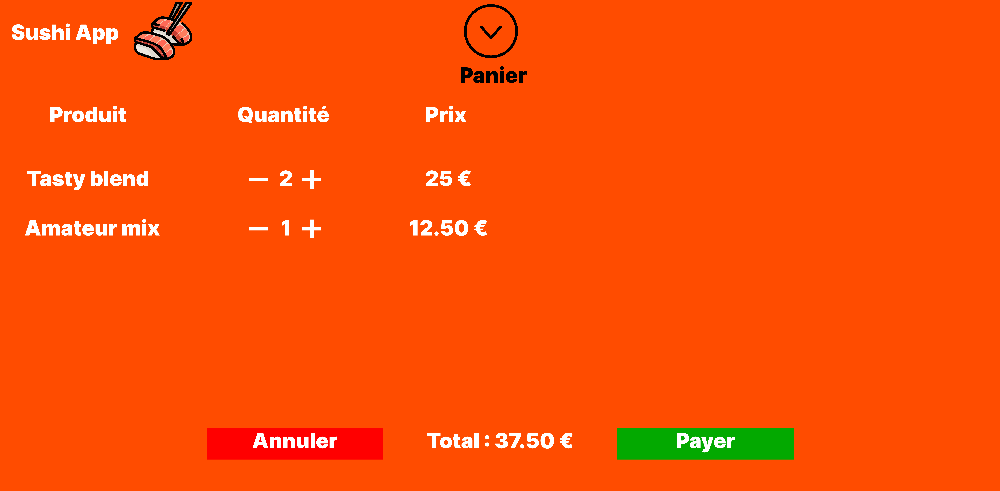
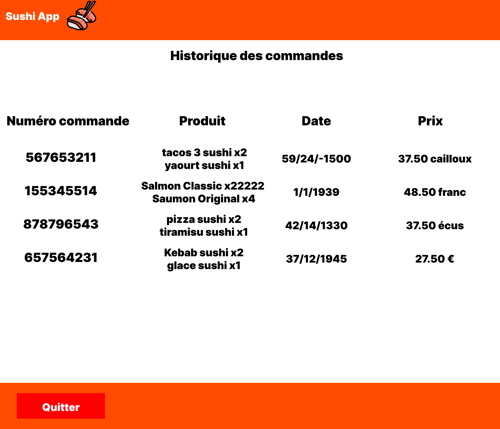
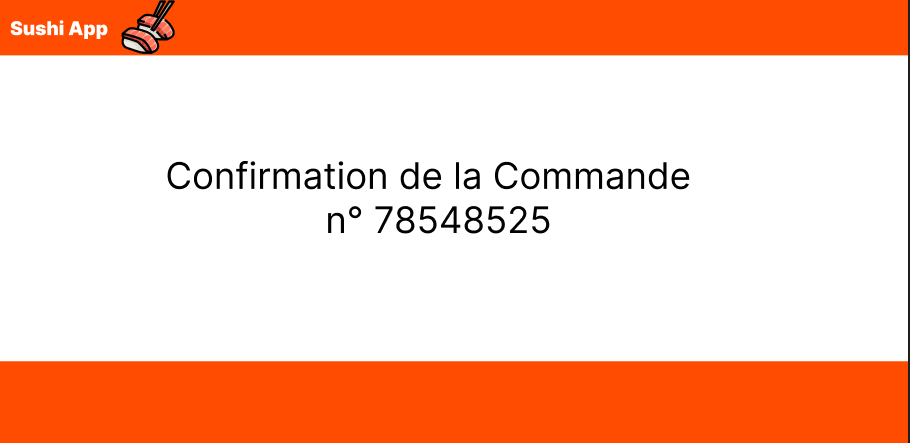

== Header et Footer

Tout d'abord j'ai commencer par faire le header et le footer
[source,html]
----
[...]

 <ul class="navbar-nav me-auto mb-2 mb-lg-0">
        <li class="nav-item ">
            <a class="nav-link active"
             routerLink="/menu"
             routerLinkActive="active" style="color: white;">
             🍽️ menu
            </a>
            <li class="nav-item ">
                <a class="nav-link active"
                 routerLink="/rgpd"
                 routerLinkActive="active" style="color: white;">
                 🔒 rgpd
                </a>
            </li>
            <li class="nav-item ">
                <a class="nav-link active"
                 routerLink="/historique"
                 routerLinkActive="active" style="color: white;">
                 <i class="bi bi-clock-history"></i> historique
                </a>
            </li>
 </ul>

[...]
----
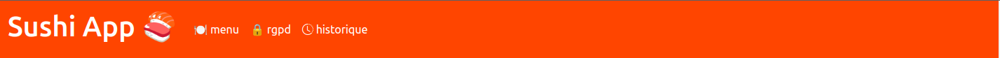

Le Header comporte la page menu qui affiche les boxes sushi que nous allons voir juste après la page
RGPD et enfin l'historique que nous allons voir plus tard

Et ensuite le footer
[source,html]
----
[...]

<footer>

    <!-- Button trigger modal -->
    <button type="button" class="btn btn-danger" data-bs-toggle="modal" data-bs-target="#footer">
        Annuler la commande
    </button>

    

        <a class="nav-link active" routerLink="/panier" routerLinkActive="active" style="color: white;">
            Panier : {{ total() | number:'1.2-2'}} €
        </a>
    

</footer>
<!-- Modal -->

    

        

            

                <h5 class="modal-title" id="exampleModalLabel">Confirmation</h5>
                <button type="button" class="btn-close" data-bs-dismiss="modal" aria-label="Close"></button>
            

            

                Êtes-vous sûr de vouloir annuler la commande ?
            

            

                <button type="button" class="btn btn-secondary" data-bs-dismiss="modal">Annuler</button>
                <button type="button" class="btn btn-danger" (click)="annuler()"  (click)="reload()" > annuler</button>
            

        

    

[...]
----
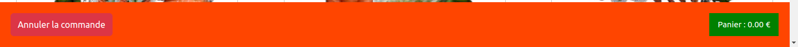

Lui le footer a le bouton panier et annuler commande que nous allons voir après

== Affichage des boxes

Pour l'affichage des boxes tout d'abord il faut les récuperer via l'API

en premier configuartion de l'API

source : environment.ts
[source,typescript]
----
export const environment = {
    production: true,
    apiBaseUrl: 'http://localhost:8080/api/boxes',
    };
----

source : environment.developments.ts
[source,typescript]
----
export const environment = {
    production: false,
    apiBaseUrl: 'http://localhost:8080/api/boxes',

    };
----

Ensuite dans le service on fait une requette html avec le lien de l'API

source : lookupboxes.service.ts

----
public getBoxes():Observable<any>{
    return this.http.get(environment.apiBaseUrl)
  }
----

On crée aussi la classe Boxes

source : iBoxes.ts
[source,typescript]
----

export interface iBoxes {
    id:number,
    pieces:number,
    nom:string,
    image:string,
    prix:number,
    saveur:Array<string>,
    aliments:Array<Iterable<string>>
    }
----

source : Boxes.ts

----
[...]

import { iBoxes } from "./iBoxes";

export class Boxes implements iBoxes {
    constructor(
    public id:number,
    public pieces:number,
    public nom:string,
    public image:string,
    public prix:number,
    public saveur:Array<string>,
    public aliments:Array<Iterable<string>>){}

    }
----

Puis maintenant on récupèrent les données des Boxes depuis l'API et en les
assignant à la propriété boxes

source: menu.component.ts

----
ngOnInit(): void {
    this.lookupBoxes.getBoxes().subscribe((data)=>{
      this.boxes = data;

    })
  }
----

mainteant on les affiches

source: menu.component.html

----

    

        

            <a routerLink="/detail/{{box.id}}" routerLinkActive="active">
                <!-- Image -->
                

                <!-- Fin de l'image  -->
            </a>
            <!-- Corp de notre carte -->
            

                <!-- Prix de la box-->
                

                    <h6>{{box.prix}}0 € <button (click)="localStorage(box)">+</button></h6>
                

                <!-- Nom de la box -->
                

                    <h3>{{box.nom}}</h3>
                

            

        

    

<app-footer></app-footer>
----

Le résultat final

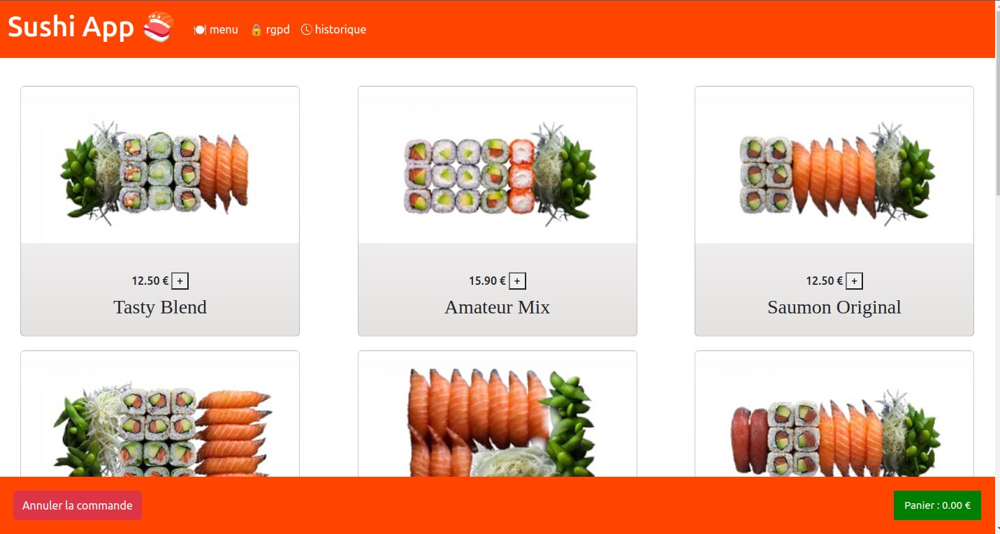

== Details

Pour l'affiche des details ils faut cliquer sur l'image de la boxes

source: menu.component.html
[source,html]
----

<a routerLink="/detail/{{box.id}}" routerLinkActive="active">
  <!-- Image -->
  

  <!-- Fin de l'image  -->
</a>
----
donc quand on clique sur l'image sa nous emmène sur la page detail avec l'id dans l'url qui
correspond a l'id de la boxes

Pour recuperer l'id du lien on utilise

source : detail.component.ts
----
this.route.params.subscribe(params => {
      this.objetId = params['id'];

    });
----
qui surveille les changements des paramètres de l'URL
et met à jour objetId avec la valeur du paramètre 'id' à chaque fois qu'il change.

Puis maintenant on récupèrent les données des Boxes depuis l'API et en les
assignant à la propriété boxes comme pour menu

source : detail.component.ts
----
ngOnInit(): void {
    this.lookupBoxes.getBoxes().subscribe((data)=>{
      this.boxes = data;
    })
----

Puis enfin dans l'html on affiche les details de la boxes en couparant l'id du lien
a tout les id des boxes afin d'afficher les détails de la bonnes boxes

source : detail.component.html

----

<link rel="stylesheet" href="detail.component.css">
<!-- fichier HTML du composant de détails (detail.component.html) -->

  

    

      <!-- Image -->
      

        
      

      <ul>
        <h2 class="nom">{{box.nom}}</h2>
        <h5>{{box.pieces}} pièces</h5>
        <h3 class="nom">{{box.prix}}0 €</h3>
        
saveurs: 

        
{{box.saveurs}}

        
aliments : 

        

          <li class="aliments">{{aliment.quantite}} {{aliment.nom}} </li>

        

----
Le résultat final

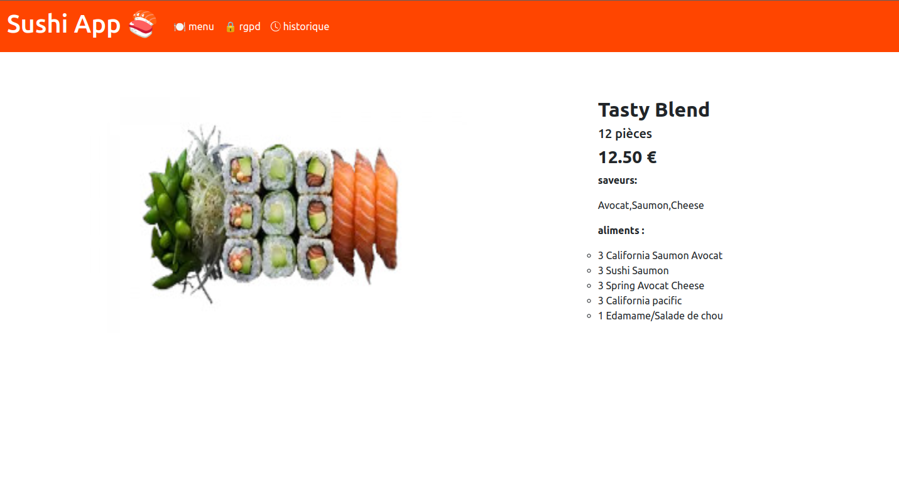

== Panier et historique

tout d'abord pour ajouter au panier il faut cliquer sur le plus qui à coter du prix

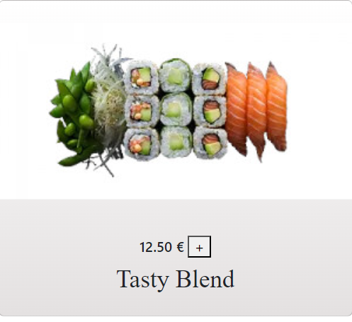

Ensuite pour afficher le panier il faut cliquer sur panier dans le footer

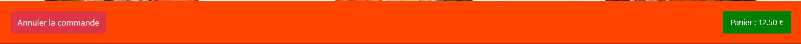

Voila l'affichage du panier avec la box sa quantité son prix total par rapport au nombre de box et le prix total du panier

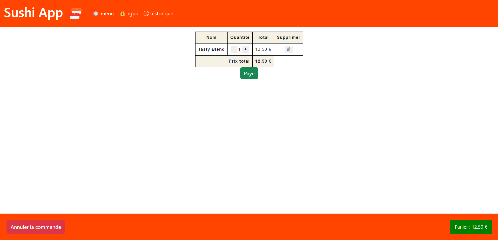

puis quand on appuie sur paye sa confirme le paiment

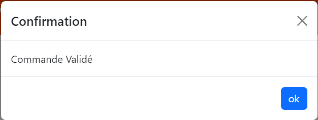

puis sa ajoute la commande dans l'historique

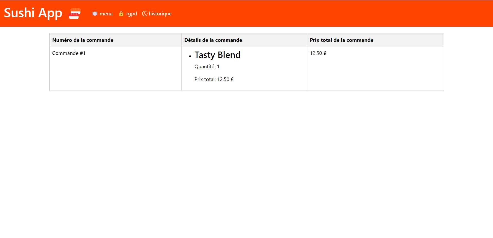

